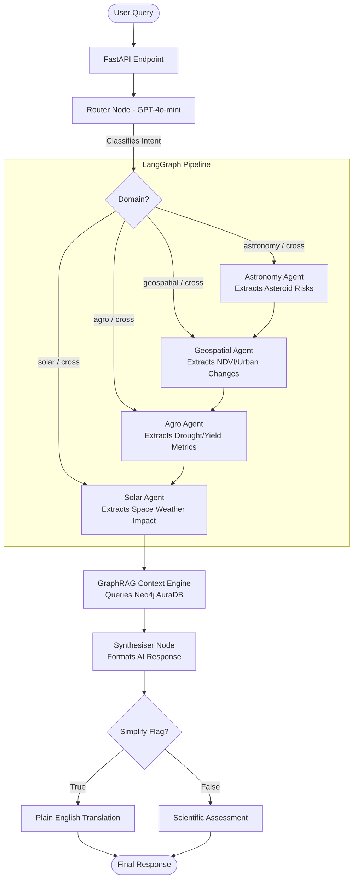

# AstroGeo: Cross-Domain Knowledge Graph & Risk Engine


**AstroGeo** is a multi-agent intelligence system designed to correlate astronomical events with terrestrial geospatial and agricultural data. It leverages a high-fidelity **Knowledge Graph (Neo4j)**, **PostgreSQL** relational tracking, and **LangGraph / GraphRAG** orchestration to synthesize insights across solar weather, asteroid trajectories, agriculture stress, and Earth's atmospheric conditions.

---

## 🧠 Multi-Agent Architecture (LangGraph)

The core intelligence of AstroGeo is powered by a directed state graph combining language models, graph databases, and relational data. 

When a natural language query is submitted, AstroGeo routes it through specialized **Domain Agents**, extracts precise metrics, builds a multi-hop context window via **GraphRAG**, and synthesizes an answer using an LLM.



### Domain Agents
1. **Router Node**: Uses LLM classification to categorize the query domain (`astronomy`, `geospatial`, `agro`, `solar`, `cross`).
2. **Astronomy Agent**: Identifies high-risk asteroid approaches and machine-learning anomaly detections from PostgreSQL.
3. **Geospatial Agent**: Fetches zone-wise vegetation loss and urban growth indicators using NDVI delta metrics.
4. **Agro Agent**: Correlates NDVI drop with spatial regions to isolate early drought warning signals and provide farming recommendations.
5. **Solar Agent**: Evaluates NASA DONKI solar flare data against terrestrial GPS disruption to predict smart-irrigation infrastructure breakdown.
6. **GraphRAG Node**: Queries the primary **Neo4j** knowledge base for deep, multi-hop connections (e.g., *Asteroid Approach* -> *Region* -> *Zone* -> *Land Cover Change*).
7. **Synthesiser**: Collates all context, formats causal chains, and adopts either a *Scientific* or *Plain English* persona.

---

## 🚀 Key Platform Features

### 🌍 Earth & Agriculture Intelligence
- **Drought Monitoring**: Composite indexing of NDVI deltas and historical precipitation to trigger district-level drought warnings.
- **Yield Prediction**: Predicts future crop yields by tracking baseline and historical weather datasets.

### ☄️ Launch & Astronomy Risk Engine
- **Predictive Model**: Voting Ensemble (Random Forest + Logistic Regression) trained on 46 years of ERA5 weather data for ISRO Sriharikota launches.
- **Minority Class Boosting**: SMOTE oversampling used to achieve high recall on historical failure cases. Conservative 0.35 risk thresholds for safety-critical operations.
- **Explainable AI (XAI)**: Full **SHAP integration** provides feature-level rationale (e.g., wind shear, monsoon cycles) for any AI prediction.

### 🔒 Cryptographic Verification Pipeline
- **Tamper-Evident Predictions**: Implements deterministic SHA-256 hashing for all executed ML inferences based on fixed model inputs.
- **Model Cards**: Transparent documentation for model benchmarks, CV scores, and evaluation baselines.

---

## 🛠 Tech Stack

| Category | Technologies |
|---|---|
| **Frontend** | Next.js, React, TailwindCSS, Chart.js, Leaflet |
| **Backend** | FastAPI, LangGraph, LangChain, OpenAI |
| **Databases** | Neo4j (Graph), PostgreSQL (Relational) |
| **Machine Learning**| Scikit-learn, Imbalanced-Learn, Pandas, SHAP |
| **Data Sources** | Copernicus (ERA5), NASA CNEOS/DONKI, ISRO Logs |

---

## 📂 Project Structure

```bash
📦 astrogeo
 ┣ 📂 backend/
 ┃ ┣ 📂 agents/          # Agent specific implementations and endpoints
 ┃ ┣ 📂 db/              # Neo4j and PostgreSQL connection pools
 ┃ ┣ 📂 orchestrator/    # LangGraph pipeline and logic
 ┃ ┣ 📂 pipelines/       # Data pipelines (Scraping, ETL)
 ┃ ┣ 📂 routers/         # FastAPI Route definitions
 ┃ ┣ 📂 responsible_ai/  # SHAP visualisations and SHA hasher
 ┃ ┗ 📜 main.py          # Application Entry Point
 ┃
 ┣ 📂 frontend/
 ┃ ┣ 📂 src/
 ┃ ┃ ┣ 📂 components/    # Reusable UI widgets and React Dashboard
 ┃ ┃ ┣ 📂 context/       # Persona context providers
 ┃ ┃ ┗ 📂 app/           # Next.js Application Routes
 ┃
 ┣ 📂 data/              # Model artifacts and static benchmarks
 ┗ 📜 README.md          # Primary documentation
```

---

## 🚦 Getting Started

### 1. Environment Setup
Copy `.env.example` to `.env` inside both the root and `backend/` directories, providing your configuration values.

```bash
cp .env.example .env
```
Ensure you have the following keys:
- `OPENAI_API_KEY`: For LangChain Agents
- `NEO4J_URI`, `NEO4J_USERNAME`, `NEO4J_PASSWORD`: For AuraDB connection
- PostgreSQL credentials `DB_HOST`, `DB_USER` etc.

### 2. Launch the Backend API
Start the FastAPI server. This exposes the REST graph-rag endpoints and prediction capabilities.
```bash
uvicorn backend.main:app --reload --port 8000
```

### 3. Launch the Frontend Application
In a separate terminal block, initialize the interactive Next.js dashboard.
```bash
cd frontend
npm install
npm run dev
```

---

## 🧪 Model Performance Data (v2.0)
- **F1-Score (Failures)**: 0.50 (Optimized for High Recall)
- **CV ROC-AUC**: 0.687
- **Training Integrity**: 108 ISRO launches matched directly against precise ERA5 variables.

---

> AstroGeo is actively engineered as a holistic AI anomaly-detection testbed, connecting orbital, atmospheric, and terrestrial disciplines into a unified decision dashboard.

---

## Production Monitoring + ML Tracking

### 1) Render backend metrics for Prometheus
- Backend already exposes Prometheus metrics at `GET /metrics`.
- Use `backend/prometheus.render.yml` for production scraping.
- Replace `your-backend-service.onrender.com` with your Render API hostname.

### 2) Grafana datasource wiring
- Grafana datasource is env-driven via `PROMETHEUS_URL`.
- Local Docker Compose uses `PROMETHEUS_URL=http://prometheus:9090`.
- For cloud Grafana, set `PROMETHEUS_URL` to your hosted Prometheus endpoint.

### 3) DagsHub + MLflow experiment logging
- GitHub Action `.github/workflows/ml-training-tracking.yml` runs `launch_model/04_train_model.py`.
- It logs metrics like F1, R2, MAE, RMSE, confusion matrix, and SHAP artifacts through MLflow.
- Configure repository secrets:
  - `DAGSHUB_USERNAME`
  - `DAGSHUB_REPO`
  - `DAGSHUB_TOKEN`

After the workflow runs, open your DagsHub MLflow page (`https://dagshub.com/<user>/<repo>.mlflow`) to view experiments and metrics.
